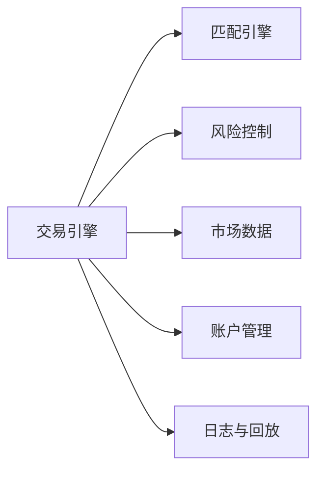
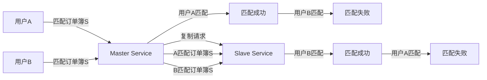
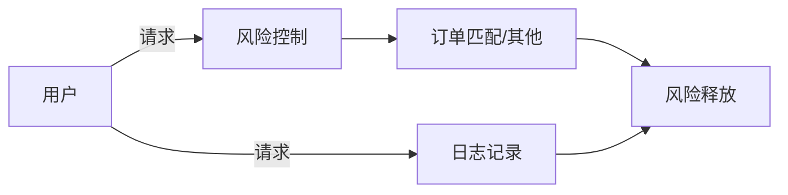

# 一. 概述

交易引擎是金融系统的核心组件，用于处理买卖订单的撮合、账户管理、清算与结算、 风险控制等。一个优秀的交易引擎需要具备高性能、高可用性、数据一致性和扩展性。

# 二. 模块设计

# 三. 设计思路

首先，要设计一个低延迟、高吞吐量的交易引擎，核心是高效的订单匹配，而基于传统数据库/磁盘的匹配显然无法达到这个要求，要实现高性能的交易引擎，就需要基于内存来进行订单的匹配。

而大量的订单匹配请求必然无法避免资源竞争问题带来的数据不一致，比如大量请求并发对同一个订单簿进行操作，不对其进行限制的话，很容易造成数据丢失。
对于这个问题，有两种解决方案：
1. 对订单簿加锁
2. 使用单线程进行订单匹配
第一种方案在大量并发的情况下，不断的加锁和解锁以及线程上下文的切换，必然会损耗很大的性能，而第二种方案使用单线程的情况下，避免了锁和线程切换的开销，同时也保证了线程安全。

当然，以上第一种方案相对于第二种方案还有一个致命的劣势，那就是唯一定序性，也就是说，对于相同的输入序列，是否有相同的输出结果，这对于一个交易核心的高可用性以及扩展性都有很大的影响。

假设，现在有两个来自不同用户的订单匹配请求竞争同一个订单簿的锁，我们假设用户A先获得锁，匹配到了合适的订单，而到用户B获得锁的时候订单已经被A匹配了，他就得不到合适的匹配订单。目前还没有任何影响，但是，当我们对于一个交易核心启动一个主从集群/复制状态机，以确保当交易核心不可用时能有其他的服务接管，然而当有大量并发请求同一个订单簿的时候，此时有大量的请求被阻塞在各个服务器上，这时候用户A和用户B的请求同时发到主服务器，并通过复制的形式复制到其他服务器，然而在其他服务器上，不一定时用户A先获得锁，有可能是用户B先获得锁，然后用户B将合适的订单匹配后，用户A再获得锁匹配订单时，已经没有合适的订单了，这时，主服务器的数据已然和其他服务器的发生了不一致的行为。类似的对于单个交易核心服务，启动日志与回放功能后，也会有类似的情况发生。

所以，为了能保证在服务不可用（内存中的数据丢失）时，能继续为用户提供正确的服务，我们必须保证订单匹配的唯一定序性。
因此，方案二是最佳选择。

以上是最核心的匹配引擎的设计，接下来，看看一个请求在交易核心的处理流程。

对于整个系统，应当使用事件驱动架构，每个请求都代表一个事件，例如：生成卖单、修改卖单、添加用户、添加交易对等这些都是事件，每个事件都应当进行风险控制和日志记录，但不一定会触发订单匹配，会触发其他的操作，最后进行风险释放，风险释放后就表示这个请求已经处理完成。

从图中可以看出，日志记录与风险控制和订单匹配是并行操作，防止I/O阻塞主线程，但是最后风险释放时依然要等待日志记录完成，这是为了保证数据的持久性，防止数据丢失。