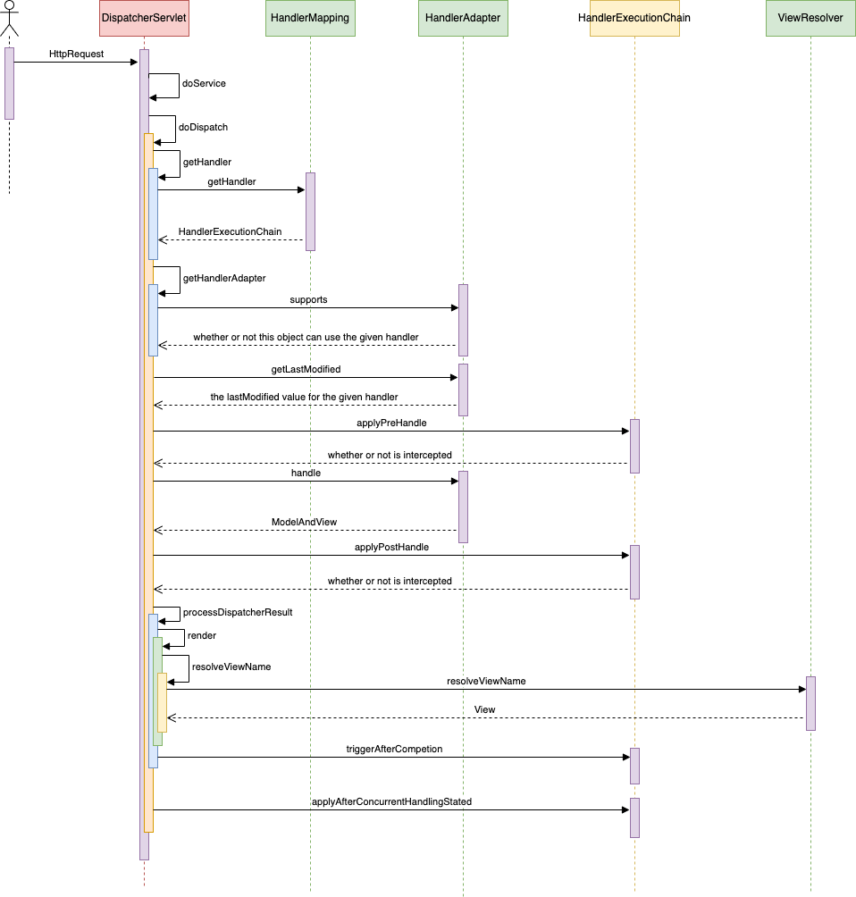

# 前言

在Spring MVC中，处理一个Web请求的流程被设计得非常清晰且高效，从客户端的请求发送到最终的响应返回，整个过程涵盖了多个核心组件的协作。理解这些组件的工作机制及其之间的交互，是掌握Spring MVC的重要基础。

当用户发出HTTP请求时，Spring MVC会通过一系列步骤来处理该请求，并生成对应的响应。这个处理流程主要包括以下关键阶段：

1. **前端控制器（DispatcherServlet）**：Spring MVC的核心，它负责接收所有进入的请求，并协调其他组件进行处理。
2. **处理器映射（Handler Mapping）**：用于确定具体的处理器（Controller）来处理当前请求。
3. **处理器（Controller）**：在接收到请求后执行相应的业务逻辑，并返回模型数据和视图信息。
4. **视图解析器（View Resolver）**：根据控制器返回的视图名，解析并生成最终的视图。
5. **视图（View）渲染**：将模型数据与视图结合，生成HTML或其他格式的响应内容，并返回给客户端。

本文将深入分析Spring MVC处理流程中的每个阶段，帮助你理解如何从请求到响应的完整工作机制。

# 整体流程

大家先看看这张图对大致流程进行一个了解（后边文章在看的时候可以结合这张图）


[](https://www.bilibili.com/video/BV1e7izYhETP/?spm_id_from=333.1007.tianma.50-3-197.click&vd_source=9910abaf8f354c2b432e475482f200eb)


我们知道SpringMVC是运行在Web容器（Tomcat、Jetty等）中的，而SpringMVC的核心处理器就是`DispatcherServlet` ，那么`DispatcherServlet` 是如何接收到要处理的Http请求的呢？

实际上，它继承了`FrameworkServlet` ，而`FrameworkServlet` 又继承了`HttpServlet` ，当Web容器收到Http请求后，会将它们发送给Servlet，并调用Servlet的`service()`方法来处理它们。

然而`FrameworkServlet`中定义了`service`方法，所以`DispatcherServlet`实际上调用的就是它父类的`service`方法，`service`方法中又调用了`processRequest`方法，而这些都是在父类`FrameworkServlet`中完成的，接下来`processRequest`方法调用了`doService`方法，就交给了子类`DispatcherServlet`来处理，而SpringMVC的核心处理流程就从`doService`方法开始了。

先给大家看下`DispatcherServlet`的调用时序图（比较丑陋，大家将就看看），时序图忽略了`doService`之前的流程，所以给大家在上面梳理了一下，接下来就只关注`doService`方法开始。




看图我们可以知道，实际上`doService`方法并没有控制各个组件进行处理，而是调用了`doDispatch`方法，`doService`只是对Request对象进行了一些处理，比如设置一些属性值。

而在`doDispatch`方法中，可谓是贯穿了SpringMVC所以的核心处理流程。这是`doDispatch`方法的代码，大家可以大概浏览一下

```java
protected void doDispatch(HttpServletRequest request, HttpServletResponse response) throws Exception {  
    HttpServletRequest processedRequest = request;  
    HandlerExecutionChain mappedHandler = null;  
    boolean multipartRequestParsed = false;  
    WebAsyncManager asyncManager = WebAsyncUtils.getAsyncManager(request);  
  
    try {  
        try {  
            ModelAndView mv = null;  
            Exception dispatchException = null;  
  
            try {  
                processedRequest = this.checkMultipart(request);  
                multipartRequestParsed = processedRequest != request;  
                mappedHandler = this.getHandler(processedRequest);  
                if (mappedHandler == null || mappedHandler.getHandler() == null) {  
                    this.noHandlerFound(processedRequest, response);  
                    return;  
                }  
  
                HandlerAdapter ha = this.getHandlerAdapter(mappedHandler.getHandler());  
                String method = request.getMethod();  
                boolean isGet = "GET".equals(method);  
                if (isGet || "HEAD".equals(method)) {  
                    long lastModified = ha.getLastModified(request, mappedHandler.getHandler());  
                    if (this.logger.isDebugEnabled()) {  
                        this.logger.debug("Last-Modified value for [" + getRequestUri(request) + "] is: " + lastModified);  
                    }  
  
                    if ((new ServletWebRequest(request, response)).checkNotModified(lastModified) && isGet) {  
                        return;  
                    }  
                }  
  
                if (!mappedHandler.applyPreHandle(processedRequest, response)) {  
                    return;  
                }  
  
                mv = ha.handle(processedRequest, response, mappedHandler.getHandler());  
                if (asyncManager.isConcurrentHandlingStarted()) {  
                    return;  
                }  
  
                this.applyDefaultViewName(processedRequest, mv);  
                mappedHandler.applyPostHandle(processedRequest, response, mv);  
            } catch (Exception var20) {  
                Exception ex = var20;  
                dispatchException = ex;  
            } catch (Throwable var21) {  
                Throwable err = var21;  
                dispatchException = new NestedServletException("Handler dispatch failed", err);  
            }  
  
            this.processDispatchResult(processedRequest, response, mappedHandler, mv, (Exception)dispatchException);  
        } catch (Exception var22) {  
            Exception ex = var22;  
            this.triggerAfterCompletion(processedRequest, response, mappedHandler, ex);  
        } catch (Throwable var23) {  
            Throwable err = var23;  
            this.triggerAfterCompletion(processedRequest, response, mappedHandler, new NestedServletException("Handler processing failed", err));  
        }  
  
    } finally {  
        if (asyncManager.isConcurrentHandlingStarted()) {  
            if (mappedHandler != null) {  
                mappedHandler.applyAfterConcurrentHandlingStarted(processedRequest, response);  
            }  
        } else if (multipartRequestParsed) {  
            this.cleanupMultipart(processedRequest);  
        }  
  
    }  
}
```

我相信大家在看过这个代码之后多多少少会对一张图有点亲切感。

这里再详细描述一下`doDispatch`方法的流程，实际上第一张图对应的就是`doDispatch`方法。

首先，会通过`HandlerMapping`去拿到与请求相对应的`HandlerExecutionChain`,对应的方法就是

```java
protected HandlerExecutionChain getHandler(HttpServletRequest request) throws Exception {  
    Iterator var2 = this.handlerMappings.iterator();  
  
    HandlerExecutionChain handler;  
    do {  
        if (!var2.hasNext()) {  
            return null;  
        }  
  
        HandlerMapping hm = (HandlerMapping)var2.next();  
        if (this.logger.isTraceEnabled()) {  
            this.logger.trace("Testing handler map [" + hm + "] in DispatcherServlet with name '" + this.getServletName() + "'");  
        }  
  
        handler = hm.getHandler(request);  
    } while(handler == null);  
  
    return handler;  
}
```

这个`HandlerExecutionChain`包含了要执行的`Handler`以及我们定义的拦截器`HandlerInterceptor[]`。拦截器中有三个方法，分别为
- `preHandler`：在执行handler之前调用
- `postHandler`：在执行handler之后调用
- `afterCompletion`：在`preHandler`被拦截成功后执行，或者在处理过程中抛出异常时执行

接下来，会获取一个`HandlerAdapor`，这个我们从名字就可以看出，处理器适配器，也就是用来执行不同的处理器的，也就是我们的Controller方法。

接着，会通过`HandlerExcutionChain`执行前置处理，也就是前置拦截器，具体方法如下

```java
boolean applyPreHandle(HttpServletRequest request, HttpServletResponse response) throws Exception {  
    HandlerInterceptor[] interceptors = this.getInterceptors();  
    if (!ObjectUtils.isEmpty(interceptors)) {  
        for(int i = 0; i < interceptors.length; this.interceptorIndex = i++) {  
            HandlerInterceptor interceptor = interceptors[i];  
            if (!interceptor.preHandle(request, response, this.handler)) {  
                this.triggerAfterCompletion(request, response, (Exception)null);  
                return false;  
            }  
        }  
    }  
  
    return true;  
}
```

这个方法会执行拦截器操作，如果请求被拦截，直接触发`triggerAfterCompletion`操作。如果请求通过，则进行下一步。

接着，就是真正执行handler的时候了，也就是执行我们的controller中的方法，因为我们从`HandlerMapping`中拿到的`Handler`是一个`Object`，不能直接执行，所以才有了`HandlerApator`适配器模式，让它执行handler。执行结束后会将我们controller中方法返回的数据包装成一个`ModelAndView`返回。

然后，继续执行拦截器方法，此次执行的是`postHandler`。

接下就到了`ViewReslover`出场了，这个大家可以在时序图中看到，调用了好几个方法才向`ViewResolver`发起请求的，实际上也就是把`ModelAndView`的信息传给`ViewResolver`将它转换成`View`。

最后就是执行`applyAfterConcurrentHandlingStarted`方法，也是一个拦截器操作，这个是在处理完整个请求流程时触发。也是由我们自定义的拦截器。

这样，整个SpringMVC的处理流程我们就梳理完了，有想更深入了解的可以按照时序图中的调用顺序去看源码，这里的方法名都和源码对应。

现如今大家一般都时前后端分离开发，所以`ViewResolver`基本上也就用不上了。

我们进行前后段分离开发的时候往往会在Controller上加`@RequestMapping`和`@RestController`注解，这时我们使用的`HandlerAdaptor`实际上时`RequestMappingHandlerAdaptor`，处理方法如下

```java
protected ModelAndView handleInternal(HttpServletRequest request, HttpServletResponse response, HandlerMethod handlerMethod) throws Exception {  
    this.checkRequest(request);  
    ModelAndView mav;  
    if (this.synchronizeOnSession) {  
        HttpSession session = request.getSession(false);  
        if (session != null) {  
            Object mutex = WebUtils.getSessionMutex(session);  
            synchronized(mutex) {  
                mav = this.invokeHandlerMethod(request, response, handlerMethod);  
            }  
        } else {  
            mav = this.invokeHandlerMethod(request, response, handlerMethod);  
        }  
    } else {  
        mav = this.invokeHandlerMethod(request, response, handlerMethod);  
    }  
  
    if (!response.containsHeader("Cache-Control")) {  
        if (this.getSessionAttributesHandler(handlerMethod).hasSessionAttributes()) {  
            this.applyCacheSeconds(response, this.cacheSecondsForSessionAttributeHandlers);  
        } else {  
            this.prepareResponse(response);  
        }  
    }  
  
    return mav;  
}
```

前后段分离时`handle`方法返回的`ModelAndView`为null，后端返回的数据都在响应体中携带。

至此，我们梳理了SpringMVC处理Http请求的大体流程。


